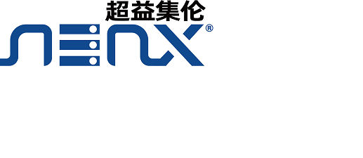



## Main Organizers

**Limin Wang** 
Nanjing University, China 
[lmwang@nju.edu.cn](mailto:lmwang@nju.edu.cn)

**Yali Wang** 
Shenzhen Institutes of Advanced Technology, Chinese Academy of Sciences, China 
Shanghai AI Lab, Shanghai, China 
[yl.wang@siat.ac.cn](mailto:yl.wang@siat.ac.cn)

**Jing Shao** 
SenseTime Group Limited, Beijing 
[shaojing@sensetime.com](mailto:shaojing@sensetime.com)

**Wei Wu** 
SenseTime Group Limited, Beijing 
[wuwei@sensetime.com](mailto:wuwei@sensetime.com)

**Junjie Yan** 
SenseTime Group Limited, Beijing 
[yanjunjie@sensetime.com](mailto:yanjunjie@sensetime.com)

**Yu Qiao** 
Shenzhen Institutes of Advanced Technology, Chinese Academy of Sciences, China 
Shanghai AI Lab, Shanghai, China 
[yu.qiao@siat.ac.cn](mailto:yu.qiao@siat.ac.cn)

## Advisors

**Rahul Sukthankar** 
Google Research 
[sukthankar@google.com](sukthankar@google.com)

**Luc Van Gool** 
CVL ETHZ, and KU Leuven 
[vangool@vision.ee.ethz.ch](vangool@vision.ee.ethz.ch)

## Supporting organizations

## Sponsor
**AMAX Information Technologies（Suzhou）CO.,LTD.** 
 

